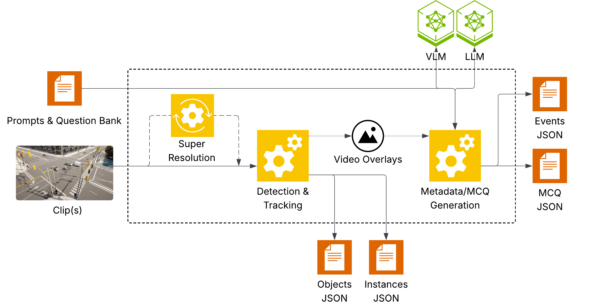

<!--
SPDX-FileCopyrightText: Copyright (c) 2026 NVIDIA CORPORATION & AFFILIATES. All rights reserved.
SPDX-License-Identifier: Apache-2.0
-->

# Physical AI Data Factory - Auto Labeling

An end-to-end pipeline that converts raw video or image inputs into DAFT-ready training scenes. It chains Super Resolution (SR), object detection and tracking, VLM-based scene understanding, and LLM-assisted task QA generation—including Multiple-Choice Questions (MCQs)—into one config-driven workflow.

By default, all four stages run in sequence. The same CLI also supports partial runs when you already have SR outputs, tracking overlays, captions, or metadata.

---

## Pipeline overview



```
Input video/image → [SR] → [Detection & Tracking] → [VLM JSON] → [MCQ Generation]
```

Each stage can be enabled or disabled independently. If SR fails or is skipped, downstream stages fall back to the original input.

| Stage | Purpose | Main artifacts |
|-------|---------|----------------|
| **Super Resolution** | Upscale input media | SR output media |
| **Detection & Tracking** | Detect objects and assign track IDs | Object/instance annotations and overlays |
| **VLM JSON** | Generate scene metadata and events | Scene/event JSON |
| **MCQ Generation** | Generate task QA | MCQ, BCQ (binary-choice), and open-QA task files |

---

## Start here

**Default workflow:** SR → detection/tracking → VLM JSON → MCQ generation.

**Requirements for a full run:** Docker with NVIDIA GPU access, input media, VLM and LLM endpoints, and an output directory. For setup, partial workflows, and hardware notes, see [docs/getting-started.md](docs/getting-started.md).

**Supported runtime:** Run pipeline commands inside a Docker container. The image includes a `uv`-managed environment; examples use `uv run python modules/cli.py` from inside the container. Host-side pipeline execution is not validated—use host-side `uv` only for development checks such as tests and lint.

**Documentation map**

| Topic | Guide |
|-------|--------|
| First run, Docker images, hardware | [docs/getting-started.md](docs/getting-started.md) |
| Smoke tests and full-matrix validation | [docs/e2e-testing.md](docs/e2e-testing.md) |
| MCQ modes, prompts, question banks | [docs/mcq-modes.md](docs/mcq-modes.md) |
| Config overrides and env vars | [docs/config-reference.md](docs/config-reference.md) |
| S3, HTTP, and MSC I/O | [docs/remote-io.md](docs/remote-io.md) |

---

## Quickstart: full pipeline

```bash
./docker/deploy.sh build
./docker/deploy.sh shell -lc '
  uv run python modules/cli.py --config configs/pipeline_example.yaml \
    data.0.inputs.video_path="/workspace/input/my_video.mp4" \
    data.0.output.out_dir="/workspace/output/my_run" \
    endpoints.vlm.url="http://host.docker.internal:<VLM_PORT>/v1" \
    endpoints.vlm.model="<VLM_MODEL_ID>" \
    endpoints.llm.url="http://host.docker.internal:<LLM_PORT>/v1" \
    endpoints.llm.model="<LLM_MODEL_ID>"
'
```

For published images, use the command shape in [Published image command shape](docs/getting-started.md#published-image-command-shape).

**Supported inputs:** images (`.jpg`, `.jpeg`, `.png`, `.webp`, `.bmp`); videos (`.mp4`, `.mov`, `.m4v`).

---

## Common usage

**Disable a stage**

```bash
super_resolution.enabled=false
detection_and_tracking.enabled=false
vlm_json.enabled=false
mcq_generation.enabled=false
```

**Batch multiple videos**

```bash
data.0.inputs.video_path="clip1.mp4" data.0.output.out_dir="output/clip1" \
data.1.inputs.video_path="clip2.mp4" data.1.output.out_dir="output/clip2"
```

**Pin GPUs** (for example, when VLM/LLM servers use GPU 0 and 1)

```bash
pipeline.gpu_ids=2,3
```

SR and tracking use GPU 2. Add `pipeline.use_multi_gpu=true` to spread SR across GPU 2 and GPU 3.

**VLM and LLM endpoints** — from inside Docker, use `host.docker.internal`, not `localhost`:

```bash
endpoints.vlm.url="http://host.docker.internal:<VLM_PORT>/v1" endpoints.vlm.model="<VLM_MODEL_ID>" \
endpoints.llm.url="http://host.docker.internal:<LLM_PORT>/v1" endpoints.llm.model="<LLM_MODEL_ID>"
```

**API keys** — set in the environment before running (first match wins):

| Service | Resolution order |
|---------|------------------|
| VLM | `VLM_API_KEY` → `NVIDIA_API_KEY` → `OPENAI_API_KEY` → `"EMPTY"` (no auth) |
| LLM | `LLM_API_KEY` → `NVIDIA_API_KEY` → `OPENAI_API_KEY` → `"EMPTY"` (no auth) |

---

## MCQ modes

Set the mode with `mcq_generation.mode=<mode>`.

Cookbooks are organized by ownership: use-case folders hold domain banks, configs, and prompts; `cookbooks/shared/` holds cross-use-case prompt logic.

| Mode | Endpoints | Use case | Default assets |
|------|-----------|----------|----------------|
| `question-driven-vlm-llm` *(blueprint default)* | VLM + LLM | Generic route for traffic, robotics, warehouse, PAS/open-QA, or custom banks | [`cookbooks/shared/`](cookbooks/shared/) templates + selected `question_bank_file` |
| `window-vlm-llm` | VLM + LLM | Traffic blueprint: VLM captions, then LLM mapping | [`cookbooks/traffic/prompts/mcq/window_vlm_llm/`](cookbooks/traffic/prompts/mcq/window_vlm_llm/) |
| `window-direct-vlm` | VLM | Traffic blueprint: VLM answers directly | [`cookbooks/traffic/prompts/mcq/window_direct_vlm/`](cookbooks/traffic/prompts/mcq/window_direct_vlm/) |
| `metadata-llm` | LLM only | Traffic blueprint: remap from existing `sidecars/metadata.json` | [`cookbooks/traffic/prompts/mcq/metadata_llm/`](cookbooks/traffic/prompts/mcq/metadata_llm/) |

See [docs/mcq-modes.md](docs/mcq-modes.md) for examples and window, retry, and VLM verify settings.

To add a domain, create or copy a cookbook under `cookbooks/<slug>/` and point the CLI at its `question_bank.json` or prompt files. See [Adding prompts or question banks](docs/mcq-modes.md#adding-prompts-or-question-banks).

---

## Failure behavior

By default, the pipeline is fallback-friendly (`pipeline.empty_output_policy=warn`). SR respects `super_resolution.window_timeout` (default `3600` seconds) so a hung SR window does not block a batch indefinitely.

If SR, tracking, or VLM JSON fails after retries, the run still produces a DAFT-compatible scene when possible:

- **SR failure:** falls back to the original input; `sidecars/pipeline_status.json` records `status=completed_degraded`.
- **Tracking:** writes contextual detection files only when valid tracking output exists.
- **VLM JSON:** writes minimal contextual files (`video.json` plus empty `events.json`, or `image.json` for image inputs).
- **MCQ:** writes task files only when valid questions are produced; otherwise task files are omitted.

Set `pipeline.empty_output_policy=fail` to stop the run on these stage failures.

---

## Output structure

```text
out_dir/                                   # DAFT v3.0 scene directory
├── raw/<media_id>.<ext>                    # analyzed media
├── contextual/
│   ├── video.json | image.json            # scene metadata
│   ├── events.json                        # VLM event list (video only)
│   ├── instances.json                     # per-track summaries
│   └── objects.json                       # per-frame detections
├── task/                                  # written only when matching items exist
│   ├── mcq.json                           # MCQ output
│   ├── bcq.json                           # BCQ output
│   └── open_qa.json                       # open-ended output
├── config.yaml                            # effective config (re-runnable)
├── prompts/                               # prompt artifacts and hashes (MCQ modes)
│   ├── scene_prompt.used.md               # when the mode uses a scene/caption prompt
│   ├── mcq_prompt.used.md                 # MCQ prompt for the selected mode
│   ├── vlm_verify_prompt.used.md          # VLM verify prompt, when verify is enabled
│   └── prompts.used.json                  # SHA-256 hashes for saved prompts
├── sidecars/                              # non-DAFT diagnostic files
│   ├── pipeline_status.json               # run status; marks SR fallback as completed_degraded
│   ├── sr_output.<ext>                    # super-resolution output (.png for image scenes)
│   ├── <track_stem>_detection.<ext>       # detection overlay (save_video=true)
│   ├── <track_stem>_tracking.<ext>        # tracking overlay (save_video=true)
│   ├── <track_stem>_tracking_red_id.<ext> # red-ID overlay (save_video_red_id=true)
│   └── metadata.json                      # per-window captions (window MCQ; input for metadata-llm)
└── logs/
    ├── pipeline.log
    ├── sr.log
    ├── tracking.log
    ├── vlm_json.log
    └── mcq.log
```

Tracking overlay `<ext>` is `.mp4` for video inputs and `.png` for image inputs. If SR ran first, `<track_stem>` is usually `sr_output`; otherwise it matches the source media stem.

---

## Troubleshooting

### Multi-GPU runs hang on shared or multi-tenant machines

Some PCIe-based systems enable PCIe Access Control Services (ACS) in BIOS, which can block NCCL's default GPU-to-GPU transport. If a multi-GPU run (`pipeline.use_multi_gpu=true`, or vLLM `--tensor-parallel-size >= 2`) hangs at startup with no GPU activity, set `NCCL_P2P_DISABLE=1` and retry:

```bash
# SR multi-GPU:
NCCL_P2P_DISABLE=1 uv run python modules/cli.py --config configs/pipeline_example.yaml ...

# vLLM endpoints with tensor parallelism:
docker run ... -e NCCL_P2P_DISABLE=1 --ipc=host --shm-size 32g ...
```

This routes NCCL traffic through CPU shared memory. Throughput may be lower, but the run completes. NVLink systems are unaffected.

### SR window timeout vs. NCCL or native hangs

`super_resolution.window_timeout` is a per-window wall-clock limit inside the SeedVR2 `torchrun` process. It stops a slow or stuck SR window from blocking a batch when Python can handle the alarm.

It is not a watchdog for every native hang. If a process blocks inside an NCCL collective, a CUDA kernel, or another native call that never returns to Python, the timeout may not fire until that call returns. For multi-GPU hangs, try `NCCL_P2P_DISABLE=1` first. For a hard process-level kill, add an operational guard around the `torchrun` process.

---

## More documentation

| Doc | Contents |
|-----|----------|
| [docs/getting-started.md](docs/getting-started.md) | Runtime setup, hardware notes, Docker image options, first-run commands |
| [docs/e2e-testing.md](docs/e2e-testing.md) | Smoke tests, full-matrix validation, expected outputs |
| [docs/mcq-modes.md](docs/mcq-modes.md) | MCQ mode examples, window/sampling knobs, retry, VLM verify, prompt overrides |
| [docs/config-reference.md](docs/config-reference.md) | Config knobs, schema gotchas, env vars, checkpoints, Docker details |
| [docs/remote-io.md](docs/remote-io.md) | S3/MSC credentials, path mapping, NVCF secrets |
| [modules/detection_and_tracking/README.md](modules/detection_and_tracking/README.md) | Tracker backends, ReID, per-class tracking |
| [modules/mcq_generation/README.md](modules/mcq_generation/README.md) | Question bank schema, question-driven mode deep-dive |

---

## Repo layout

```text
modules/
├── cli.py                       # main entry point
├── pipeline.py                  # 4-stage orchestrator
├── nvcf_msc_utils.py            # NVCF cloud + MSC remote I/O
├── config/                      # YAML loader, schema
├── al_utils/                    # shared schema + helpers
├── sr_runner/                   # SeedVR2 super-resolution
├── detection_and_tracking/      # RF-DETR + tracking
├── vlm_json/                    # VLM JSON generation
└── mcq_generation/              # MCQ generation (4 modes)
configs/
└── pipeline_example.yaml        # single blueprint config
docker/
docs/
```

---

## Agent-assisted workflows

The component-level agent skill lives under `.agents/skills/`; `.claude/skills` and `.codex/skills` are compatibility symlinks:

- `/auto-labeling` — build and run pipeline commands. Example use cases: [custom-question captioning](.agents/skills/auto-labeling/references/custom-caption.md) and the shipped [PAS / person-attribute caption preset](.agents/skills/auto-labeling/references/person-attribute-caption.md).

---

## Notice

**NOTICE AND DISCLAIMER:** This software automatically retrieves, accesses or interacts with external materials. Those retrieved materials are not distributed with this software and are governed solely by separate terms, conditions and licenses. You are solely responsible for finding, reviewing and complying with all applicable terms, conditions, and licenses, and for verifying the security, integrity and suitability of any retrieved materials for your specific use case. This software is provided "AS IS", without warranty of any kind. The author makes no representations or warranties regarding any retrieved materials, and assumes no liability for any losses, damages, liabilities or legal consequences from your use or inability to use this software or any retrieved materials. Use this software and the retrieved materials at your own risk.
