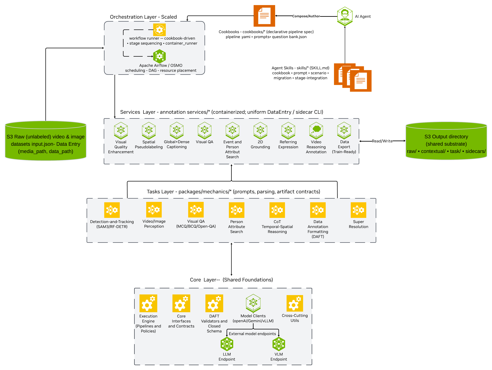
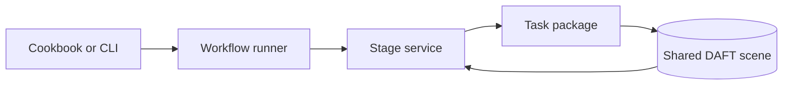

# Physical AI Data Factory - Auto-Labeling

## Overview

Auto-Labeling is the PAIDF workflow repository for turning raw
image and video datasets into reusable annotation artifacts and training-ready
outputs. It composes containerized stages for super resolution, detection and
tracking, captioning, Visual QA, reasoning, 2D grounding, referring expressions,
person-attribute search, and training export.

Auto-Labeling is cookbook-driven: each cookbook defines the input media, stage order,
model endpoints, checkpoint mounts, prompts, question banks, and output layout
for a complete labeling workflow. The workflow runner compiles those cookbooks
into local container execution plans and writes results into a shared DAFT scene
directory containing `raw/`, `contextual/`, `task/`, and `sidecars/` artifacts.

Use this repo when you need to:

- run a sample auto-labeling workflow after staging NGC sample media
- adapt a cookbook to a new dataset or annotation target
- validate stage outputs and DAFT artifact contracts
- package completed annotations for downstream training or review

## Quick Start

### Prerequisites

- Python 3.12 or newer
- [uv](https://docs.astral.sh/uv/getting-started/installation/)
- GNU Make

Container workflows also require Docker or Podman. GPU stages require a
compatible GPU runtime, such as Docker with the NVIDIA Container Toolkit, plus
the checkpoints and VLM/LLM endpoints selected by the cookbook.

### Run a sample workflow

```bash
make sync
make run SCRIPT=workflow-runner:main ARGS='--help'
```

Copy the nearest tracked cookbook to a gitignored `*.local.yaml`, replace its
media, output, model-cache, and endpoint placeholders, then inspect the
container plan before execution:

```bash
cp cookbooks/video_data_augmentation/configs/pipeline_video.yaml \
  cookbooks/video_data_augmentation/configs/pipeline_video.local.yaml

CONFIG=cookbooks/video_data_augmentation/configs/pipeline_video.local.yaml

ARGS="--cookbook-file ${CONFIG} --container-dry-run" \
  make run SCRIPT=workflow-runner:main

ARGS="--cookbook-file ${CONFIG} --container-user auto" \
  make run SCRIPT=workflow-runner:main
```

Full walkthrough: [Getting Started](docs/user-guide/getting-started.md).

Keep API keys in the host environment. Do not place credentials in cookbook
files, command history, logs, or generated evidence. Pass the required
environment-variable name to stage containers, for example
`--container-env NVIDIA_API_KEY` or `--container-env GEMINI_API_KEY`.
Remote paths also require
[Multi-Storage Client configuration](docs/user-guide/remote-storage.md).

### Contribute to this repository

After `make sync`, run the contributor checks before you change code:

```bash
make lint-check
make mypy
make test
```

Details: [Local Development](docs/developer/local-development.md). Model-client
internals for new VLM/LLM wiring:
[Model Client Architecture](docs/developer/architecture/model-client-architecture.md).

## Architecture



Services package and expose reusable task implementations. The workflow runner
launches selected services in a fixed relative order over a shared DAFT scene.


```mermaid
flowchart LR
    C[Cookbook or CLI] --> W[Workflow runner]
    W --> S[Stage service]
    S --> T[Task package]
    T --> D[(Shared DAFT scene)]
    D --> S
```

Dependency direction is `services -> tasks -> core`. Services communicate
through `DataEntry` JSONL manifests and the scene directory, not through direct
service imports. Core must remain reusable, and tasks must not import services.

See [Services Overview](docs/developer/architecture/services-overview.md) for the stage
order and [Artifact Contract](docs/developer/architecture/artifact-contract.md) for file
ownership and reuse behavior.

## Components

| Capability | Product reference |
| --- | --- |
| Workflow orchestration | [Workflow Runner](docs/developer/architecture/services-overview.md#workflow_runner) |
| Super resolution | [Super Resolution](docs/developer/architecture/services-overview.md#super_resolution_service) |
| Detection and tracking | [Detection and Tracking](docs/developer/architecture/services-overview.md#detection_and_tracking_service) |
| Captioning | [Captioning](docs/developer/architecture/services-overview.md#captioning_service) |
| Visual QA | [Visual QA](docs/developer/architecture/services-overview.md#visual_qa_service) |
| Reasoning | [Reasoning](docs/developer/architecture/services-overview.md#reasoning_service) |
| Visual Attribute Search | [Visual Attribute Search](docs/developer/architecture/services-overview.md#event_and_person_attribute_search_service) |
| 2D grounding | [2D Grounding](docs/developer/architecture/services-overview.md#grounding_2d_service) |
| Referring expressions | [Referring Expressions](docs/developer/architecture/services-overview.md#referring_expressions_service) |
| Training export | [Training Export](docs/developer/architecture/services-overview.md#training_export_service) |
| DAFT validation | [Artifact Contract](docs/developer/architecture/artifact-contract.md) |

`example_service` and `example_task` are scaffolding templates, not production
pipeline stages.

## Input and Output Contract

Service inputs are `DataEntry` records:

```json
{"id": "clip-001", "media_path": "/data/clip.mp4", "data_path": "/output/clip-001"}
```

- `media_path` identifies the caller-provided media.
- `data_path` identifies the shared DAFT scene directory.
- The shared pipeline preserves the original source as `sidecars/raw.<ext>` and
  promotes transformed media through `sidecars/active.<ext>`.
- Existing active sidecars are reused across stage containers; callers should
  not rewrite `media_path` between stages.

Manual and scripted experiments use:

```text
<experiment-root>/
├── input.jsonl
├── source/
├── logs/
└── data/
    └── <entry-id>/
        ├── raw/
        ├── contextual/
        ├── task/
        └── sidecars/
```

See [Experiment Output Layout](docs/user-guide/experiment-output-layout.md) and the
[Artifact Contract](docs/developer/architecture/artifact-contract.md) for the complete
contract.

## Running Services

Use the interactive selector or specify a registered script:

```bash
make run
make run SCRIPT=captioning-service:main ARGS='--help'
make run SCRIPT=example-service:main ARGS='--input-file payloads/simple.jsonl'
```

Scripts are discovered from `[project.scripts]` in package `pyproject.toml`
files. Interactive runs offer presets from `[tool.run.default-args]`; explicit
`ARGS` overrides the preset and is forwarded unchanged to the selected script.

For larger inputs, prefer `--input-file` over inline JSON. For development runs
that must preserve the source scene, pass `--dev-data-root <path-or-url>` to a
service built on the shared service interface. The service copies each input
scene to `<root>/<entry.id>`, replacing an existing ID-named copy, and runs
against that copy. A missing local source starts as an empty scene; the
development root may be local or supported remote storage.

Build registered images interactively or by target:

```bash
make build
make build IMAGE=captioning-service:main
```

Image targets are registered in service `pyproject.toml` files. See
[Stage Images](docs/user-guide/operations-workflow-runner.md#stage-images)
for the complete target list.
`make build` discovers them from `[tool.build.images]`, and registered build
commands run from the repository root.

## Repository Layout

```text
packages/core/                    # shared DAFT, media, model clients, and storage
packages/tasks/<task-name>/       # reusable annotation behavior
services/<service-name>/          # CLI and container packaging
services/workflow_runner/         # cookbook compiler and local launcher
cookbooks/<scenario>/             # workflow configs, prompts, and question banks
docs/                             # user-guide, developer docs, and compatibility pointers
docker/                           # shared Docker assets
observability/                    # collector and dashboard assets
payloads/                         # example DataEntry manifests
scripts/                          # workspace run, build, and media-toolchain helpers
skills/                           # repository-local agent guidance
```

## Development

```bash
make help        # list supported targets
make sync        # install all workspace packages and extras
make lint        # format and fix lint findings
make lint-check  # check formatting and lint without changes
make mypy        # run static type checks
make test        # run tests, coverage, and JUnit reporting
make check       # sync, format/fix, type-check, and test
```

Before submitting a merge request, run the non-mutating checks or review any
formatting changes produced by `make check`.

Pre-commit hooks are optional. Install them with
`uv tool install pre-commit --with pre-commit-uv --force-reinstall`, then use
the repository `.pre-commit-config.yaml`.

## Documentation

Use the [Documentation Index](docs/README.md) to choose a path:

- **Run the product:** [User Guide](docs/user-guide/README.md) →
  [Getting Started](docs/user-guide/getting-started.md)
- **Change the code:** [Developer Docs](docs/developer/README.md) →
  [Local Development](docs/developer/local-development.md)

Repository-local guidance for supported agent workflows lives under `skills/`.

## Project Policies

- [Contributing](CONTRIBUTING.md) explains the development and review workflow.
- [Security Policy](SECURITY.md) provides the private vulnerability-reporting
  path.

For non-sensitive questions and defects, consult the documentation first, then
use the repository's GitLab issue workflow. Do not report security or conduct
concerns in a public issue.

## Responsible Use

Auto-Labeling outputs are machine-generated annotations and may be incomplete,
inaccurate, or biased. Apply human review and domain-specific quality checks
before using them for training, evaluation, or operational decisions.

Only process media and metadata that you are authorized to use. Protect
personal and confidential information, confirm applicable dataset and model
licenses, and evaluate the downstream impact of generated labels for the
intended use case.

## License and Contributions

The PAIDF Auto-Labeling Project is licensed under the Apache 2.0 license. This project is currently not accepting contributions.

## Redistribution Notice

The PAIDF Auto-Labeling Project redistributes modified code from other projects. Details may be found in the following files:

Boosttrack: see [packages/tasks/detection_and_tracking/src/detection_and_tracking/backends/boosttrack/UPSTREAM_LICENSE.md](packages/tasks/detection_and_tracking/src/detection_and_tracking/backends/boosttrack/UPSTREAM_LICENSE.md)

SeedVR2: see [packages/tasks/super_resolution/src/super_resolution/UPSTREAM_LICENSE.md](packages/tasks/super_resolution/src/super_resolution/UPSTREAM_LICENSE.md)
