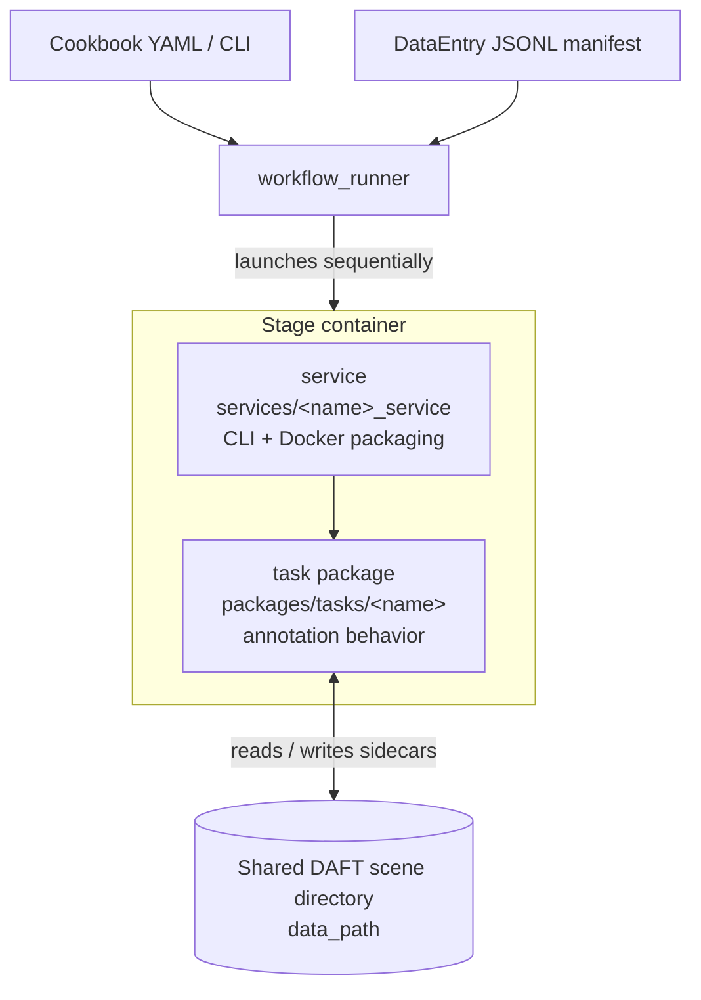
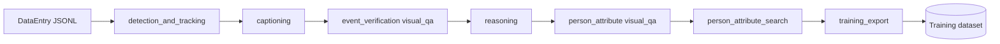
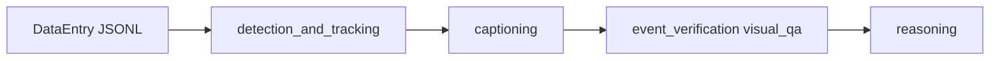

# Services Overview

This document indexes the annotation **services** in this repository: what each
one is responsible for, what it consumes, and what it produces. It is a living
reference — keep it in sync when a service's contract changes.

Related architecture docs:

- [`artifact-contract.md`](artifact-contract.md) — the outputs each stage writes,
  overwrite/reuse rules, and degraded-state semantics.
- [`model-client-architecture.md`](model-client-architecture.md) — how services
  talk to VLM/LLM endpoints.

## Table of Contents

- [Design shape](#design-shape)
- [Pipeline dataflow](#pipeline-dataflow)
- [Service index](#service-index)
- [Notes](#notes)

## Design shape

Each stage is split into two layers:

- A **task package** (`packages/tasks/<name>`) owns the reusable annotation
  behavior.
- A **service** (`services/<name>_service`) owns CLI parsing, Docker image
  registration, and runtime packaging around that task.

Services do not import each other. They communicate only through a shared
`DataEntry` JSONL manifest and a shared **DAFT scene directory** (`data_path`),
writing sidecars and `task/` / `contextual/` outputs that downstream services
read. `workflow_runner` compiles a cookbook into an ordered sequence of stage
containers over that shared directory.

Every `DataEntry` carries:

- `media_path` — caller-provided image or video.
- `data_path` — the DAFT scene directory where sidecars and task outputs land.

## Pipeline dataflow

There is no single fixed pipeline. Shipped cookbooks declare `workflow.nodes`
with `needs`. The runner executes that recipe in topological order. Every node
reads from and writes to the same DAFT scene directory, so a later node consumes
sidecars an earlier node produced (see
[`artifact-contract.md`](artifact-contract.md)).

`referring_expressions` and `grounding_2d` currently support image inputs only.
They are omitted from the video `--stages` order below.

CLI `--stages` (no cookbook nodes) still uses a fixed relative order:

Video: `super_resolution` → `detection_and_tracking` → `captioning` →
`visual_qa` → `reasoning` → `training_export` → `person_attribute_search`

Image: `detection_and_tracking` → `referring_expressions` → `captioning` →
`grounding_2d` → `visual_qa` → `reasoning` → `training_export` →
`person_attribute_search`

Cookbook `needs` can place `person_attribute_search` before `training_export`.
The examples below are the shipped cookbooks.

**Visual attribute search with training export**
(`cookbooks/visual_attribute_search/configs/pipeline_video_pas_reasoning.yaml`).
Captioning and Visual QA are separate producer nodes; PAS is assembly-only;
training export runs last:

**Smart Spaces warehouse event reasoning**
(`cookbooks/smart_spaces/configs/pipeline_warehouse_event_reasoning.yaml`).
This sample **does** run detection. It does not run PAS or training export:

**Video data augmentation**
(`cookbooks/video_data_augmentation/configs/pipeline_video.yaml`).
Enhance media first, then annotate:

## Service index

### workflow_runner

- **Responsibility:** Auto-Labeling recipe compiler and local launcher.
  Reads CLI args or a cookbook YAML, resolves inputs/prompts/question banks/stage
  args/mounts and optional node dependencies, then runs the selected stage
  containers sequentially. It is not a general-purpose orchestrator — scheduling,
  distributed execution, and retry policy belong to platform tooling (OSMO,
  Airflow).
- **Inputs:** cookbook YAML (or CLI flags) + `DataEntry` JSONL manifest.
- **Outputs:** writes `logs/workflow_runner.jsonl` for local scene paths and
  drives the stage containers below, which write their artifacts to the shared
  scene directory.

### super_resolution_service

- **Responsibility:** wrapper around `packages/tasks/super_resolution`
  (SeedVR2). Upscales/enhances media before annotation.
- **Inputs:** `DataEntry` records; accepts `.mp4`/`.mov` video and
  `.jpg`/`.jpeg`/`.png`/`.webp` image suffixes. Needs GPU + checkpoints for a
  real run.
- **Outputs:** enhanced media written for downstream stages.

### detection_and_tracking_service

- **Responsibility:** wrapper around `packages/tasks/detection_and_tracking`.
  Runs detection + tracking (stub, RF-DETR/BoostTrack, or SAM3) and optional
  crop extraction. Must run before per-track person-attribute work.
- **Inputs:** `DataEntry` records; tracker selection and class/prompt flags
  (e.g. `--tracker sam3 --sam3-prompts person`).
- **Outputs:** DAFT track data (`contextual/instances.json`, plus the opt-in
  `contextual/tracking.json`) and, when crop extraction is enabled, a non-DAFT
  crop seam consumed by per-track person-attribute work
  (`sidecars/detection_and_tracking/tracks.json` and per-track crops under
  `sidecars/tracks/crops/`). See the
  [artifact contract](./artifact-contract.md) for the exact paths and output
  kinds.

### referring_expressions_service

- **Responsibility:** wrapper around `packages/tasks/referring_expressions`.
  Given known DAFT boxes (`contextual/objects.json`), draws a numbered overlay
  and asks a VLM for short discriminative region phrases (Step 0 MVP). Links
  predictions by mark id, then greedy IoU; keeps authoritative DAFT boxes.
- **Inputs:** image `DataEntry` records; `contextual/objects.json` from
  detection (or prior grounding); VLM endpoint (`NVIDIA_API_KEY`).
- **Outputs:** `sidecars/referring_expressions/referring_expressions.json` and
  `sidecars/referring_expressions/` (`step0_region_expressions.json`, plus
  `marked_boxes.jpg` only when overlay drawing is enabled). Image MVP only.
- **Cookbook:** `cookbooks/image_spatial_grounding/`.

### grounding_2d_service

- **Responsibility:** wrapper around `packages/tasks/grounding_2d`. Extracts
  referring expressions from a scene caption (VLM), filters abstract phrases,
  then grounds remaining phrases with SAM3 via `detection_and_tracking`.
- **Inputs:** image `DataEntry` records; caption from `--caption` / config,
  `sidecars/input.json`, or upstream captioning artifacts; VLM endpoint auth
  depends on the configured provider/endpoint (hosted NVIDIA typically uses
  `NVIDIA_API_KEY`); SAM3 model cache.
- **Outputs:** `sidecars/grounding_2d/grounding_2d.json` and
  `sidecars/grounding_2d/` (`step0_expressions.json`, `step1_grounding.json`).
  Image MVP only.
- **Cookbook:** `cookbooks/image_spatial_grounding/`.

### captioning_service

- **Responsibility:** dense captions for images and videos — "what happened in
  this image or video?".
- **Inputs:** `DataEntry` records; VLM/LLM endpoint config.
- **Outputs:** Video scenes can produce `contextual/chunks.json`,
  `task/temporal_description.json`, `task/scene_description.json`, and
  `task/video_summarization.json`. Image scenes produce
  `task/scene_description.json` plus compact and raw image-caption sidecars
  under `sidecars/captioning/`.

### visual_qa_service

- **Responsibility:** upstream visual question-answering. Prepares raw and
  normalized QA sidecars, then pivots normalized items into DAFT `task/` files.
- **Inputs:** `DataEntry` records; a question bank; a generation mode:
  - `normalize-only` (default) — expects an existing QA sidecar.
  - `window-direct-vlm` — answers the bank directly from each window (VLM).
  - `window-vlm-llm` — VLM extracts evidence, LLM answers (also produces closed
    `mcq.json` / `bcq.json` via the DAFT pivot).
  - `question-driven-vlm-llm` — legacy pseudo-labeling QD parity: LLM-generated
    scene and mapper prompts, then window VLM → LLM mapping; prompts saved under
    `sidecars/visual_qa/prompts/`.
- **Outputs:** QA sidecars plus DAFT `task/` files for MCQ, BCQ, and open QA.

### reasoning_service

- **Responsibility:** wrapper for the `reasoning` task package. Runs DAFT
  exporters (scene description, summarization, open-ended QA, MCQ/BCQ open-ended,
  temporal localization, causal linkage, MSTED, events, anomaly) over existing
  scene directories.
- **Inputs:** `DataEntry` records pointing at existing DAFT scenes; a
  `DaftExportConfig` (`--config-file`) enabling the optional LLM substages; LLM
  endpoint config.
- **Outputs:** DAFT `task/` reasoning files, including open-ended QA and
  per-answer reasoning traces.

### event_and_person_attribute_search_service

- **Responsibility:** the **Visual Attribute Search** assembly stage
  (stage key `person_attribute_search`). It consumes existing attributes or
  upstream sidecars and generates retrieval queries. It does not caption media,
  run Visual QA, copy crops, or create tracking data. Those producers are
  separate cookbook nodes (`detection_and_tracking`, `captioning`, `visual_qa`).
- **Inputs:** `DataEntry` records; either `--attribute-json` or scene-local
  Visual QA sidecars (`sidecars/visual_qa/items.json` for one identity, or
  `sidecars/visual_qa/windows.normalized.json` plus
  `sidecars/detection_and_tracking/tracks.json` for video tracks). Per-track
  video PAS needs detection/tracking and a person-attribute Visual QA node
  first. Query generation needs an LLM endpoint.
- **Outputs:** `sidecars/person_attribute_search/` deliverables (`pas.json`,
  `pas_anomaly.json`, `chunk_queries.json`, `attributes.json` / `queries.json`,
  or the bundle equivalents) and optional `contextual/person_attributes.json`.
- **Cookbook:** `cookbooks/visual_attribute_search/`.

  > The code identifier, stage key, and `person_attribute_search` output dir are
  > kept as a stable internal contract even though the product name is "Visual
  > Attribute Search".

### training_export_service

- **Responsibility:** aggregate completed DAFT scene directories into training
  datasets. Runs after annotation services complete.
- **Inputs:** one `DataEntry` per completed scene; one or more export formats
  (e.g. `tao-vl-reason-v1.0`, `cosmos-reason-v1.0`).
- **Outputs:** training-format dataset(s) under the export directory, optionally
  copying media.

## Notes

- `example_service` / `example_task` are scaffolding templates for new stages,
  not part of any production pipeline.
- `daft_validation` runs inline within stage pipelines to validate DAFT outputs;
  it is not a standalone service.
